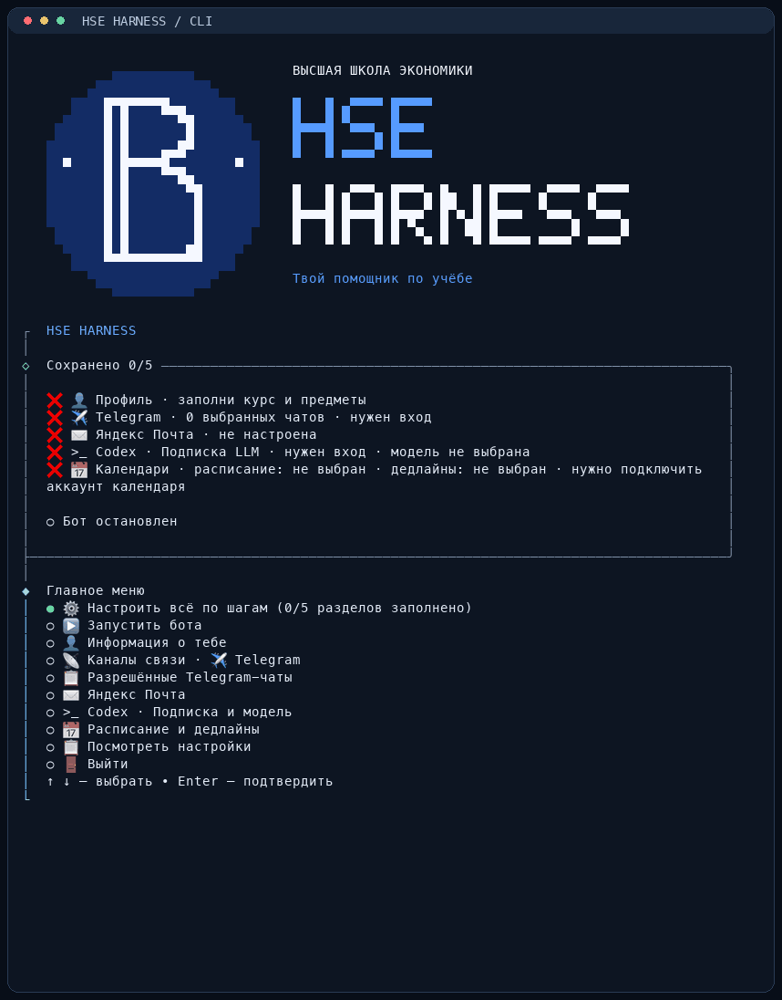

# HSE HARNESS

**Учебный ассистент, с которым можно общаться в Telegram.** Он читает выбранные учебные чаты и Яндекс Почту, собирает задания, напоминает о сдаче и ведёт отдельный календарь дедлайнов. Ты подключаешь свои аккаунты и указываешь свой курс, группу и предметы.

## Как выглядит настройка



Запись настоящего CLI: выбор раздела, заполнение демонстрационного профиля и сохранённые настройки. Все данные в примере вымышленные.

## Что умеет ассистент

- Читать текст из выбранных Telegram-групп, каналов и папок Яндекс Почты.
- Находить задания и сроки, замечать переносы и отмены.
- Учитывать расписание из Google, Яндекс или iCloud Calendar; хранить дедлайны в отдельном календаре.
- Присылать сводки в **10:00 и 20:00 по Москве**, напоминать **за три дня, сутки и час**. Срочные изменения сообщать сразу, в том числе ночью.
- Различать «сделал» и «сдал»: готовая, но ещё не отправленная работа продолжает требовать сдачи.
- Предлагать вопрос в учебный чат, если срок непонятен. Отправлять его от твоего аккаунта после твоего подтверждения.

Сейчас ассистент работает с текстом. SmartLMS, вложения, скриншоты и голосовые не обрабатываются; выполнение домашних заданий в эту версию не входит. Найденные сроки стоит сверять: модель может ошибиться или не увидеть задание за пределами подключённых источников.

## Скачать и запустить

Понадобятся [Node.js](https://nodejs.org/) **22.19 или новее** с npm и [Git](https://git-scm.com/). Затем выполни в терминале:

```sh
git clone https://github.com/festy23/hse-harness.git
cd hse-harness
npm run harness
```

Первый запуск сам устанавливает зависимости и открывает меню **HSE HARNESS**. Pi — движок агента — тоже установится автоматически.

На macOS и Linux вместо `npm run harness` можно использовать короткую команду `./hse`.

## Подключить свои аккаунты

В меню выбери **«Настроить всё по шагам»** или открой нужный раздел отдельно. Каждый законченный раздел сохраняется; остальные можно настроить позже.

| Раздел | Что потребуется |
| --- | --- |
| 👤 Информация о тебе | Имя, вуз, программа, группа, курс, учебный год и список предметов. Майнор и НИС можно добавить в том же разделе. |
| ✈️ Telegram | Собственный бот от [BotFather](https://t.me/BotFather), его токен и `API ID` / `API hash` с [my.telegram.org](https://my.telegram.org). CLI выполнит вход в личный аккаунт и предложит выбрать чаты и каналы. |
| ✉️ Яндекс Почта | Адрес учебного ящика, включённый IMAP и [пароль приложения](https://id.yandex.ru/security/app-passwords) типа «Почта». |
| `>_` Подписка и модель | Вход через ChatGPT и выбор доступной модели. Сейчас поддерживается подписочный вход OpenAI; CLI подскажет, как авторизоваться. |
| 📅 Расписание и дедлайны | Два разных календаря: один с расписанием, второй для событий ассистента. Можно выбрать iCloud, Яндекс или Google, в том числе разных провайдеров для этих двух ролей. |

Для **iCloud** нужен адрес Apple Account и [пароль приложения](https://account.apple.com/). Для **Яндекс Календаря** — отдельный пароль приложения типа «Календарь». Для **Google** — OAuth client ID и client secret. [Подробная инструкция по подключениям](docs/technical-guide.md#подключения).

**Управление:** ↑ ↓ — выбрать, Enter — подтвердить, пробел — отметить чат. Ctrl+C отменяет текущий раздел; в главном меню завершает CLI. ✅ означает, что настройки сохранены, ❌ — что раздел ещё нужно настроить. Пункт **«Разрешённые Telegram-чаты»** показывает, какие источники выбраны для чтения и где разрешены вопросы после подтверждения.

## Начать пользоваться

1. После настройки выбери **«Запустить бота»** в CLI.
2. Открой личный чат со своим ботом в Telegram и нажми **Start**.
3. Дождись разбора доступной истории выбранных источников. Сейчас начальная дата — **1 сентября 2026 года**; найденные задания нужно сверить и отметить уже сданные.
4. После сверки отправь **`/ready`**, чтобы включить напоминания.

Пока процесс работает, можно общаться обычными сообщениями:

```text
Какие задания нужно сдать на этой неделе?
Сделал домашку по алгебре, но ещё не сдал.
Сдал домашку по алгебре.
```

| Команда боту | Что покажет или сделает |
| --- | --- |
| `/tasks` | Работы с известными сроками в календаре. |
| `/status` | Состояние подключений, очередь сообщений и готовность напоминаний. |
| `/ready` | Включит напоминания после начальной сверки. |

Основной диалог идёт **через аккаунт бота**. Твой личный Telegram-аккаунт нужен для чтения учебных источников и отправки согласованных вопросов. Изменения календаря расписания тоже требуют подтверждения; свой календарь дедлайнов ассистент обновляет автоматически.

## Запуск, обновление и остановка

```sh
npm run harness -- start           # запустить бота
npm run harness -- status          # посмотреть сохранённые настройки
npm run harness -- telegram-chats  # посмотреть разрешённые чаты
```

`status` в терминале показывает сохранённые данные; реальные подключения проверяет `/status` в боте.

Чтобы обновиться, останови бота через **Ctrl+C** в терминале, где он запущен, затем:

```sh
git pull
npm run harness
```

Если изменились зависимости, CLI обновит их сам. После изменения профиля, источников или календарей перезапусти бота.

Для постоянной работы нужен включённый компьютер или VPS. Если бот запущен в терминале, держи этот процесс открытым. Для сервера есть [инструкция и шаблон systemd](docs/technical-guide.md#vps).

## Данные и доступ

Бот принимает команды только от настроенного владельца в личном чате. Модель получает сообщения из выбранных учебных источников; учитывай это при выборе чатов и папок.

Настройки и доступы хранятся локально. `.env`, `config.local.json`, `secrets/` и `data/` исключены из Git: каждый человек подключает собственные аккаунты. При переносе на сервер сохрани эти файлы и каталоги — в них настройки, авторизация и история агента. Не публикуй их вместе с репозиторием.

## Подробнее о проекте

- [Подключения, разработка, память и обслуживание](docs/technical-guide.md)
- [Спецификация агента](docs/specification.md)
- [План реализации](docs/implementation-plan.md)
- [Проверенные сценарии и ограничения тестов](docs/e2e-report.md)
- [Термины и правила проекта](CONTEXT.md)
